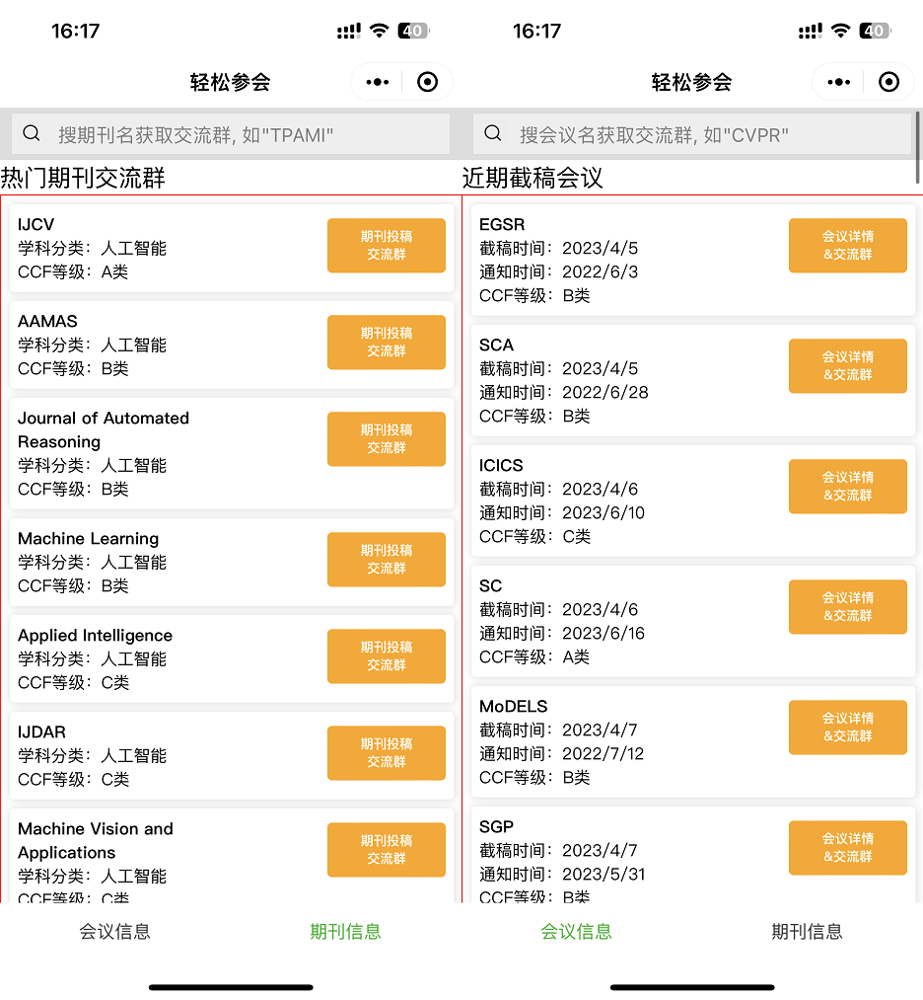

# Awesome Lists for Tenure-Track Asst. Professors and PhD students 

 

## Introduction

As an incoming Tenure-Track Assistant Professor (TTAP) and a recently graduated CS PhD (as of 09/2022), I believe I am in a good position to start collecting useful resources (awesome lists) for TTAPs and PhD students. From my perspective, I hope these lists can contribute to yours, and my success (for TTAP, success is defined as getting a tenured position in six years; for PhD student, success is defined as happily graduated, eventually). These lists include stuff like GPU cost-compute trade-offs, funding resources, etc., which I believe would be important for TTAPs aside from the research we do. I hope I could continue to refine these lists throughout my time as a TTAP, and I truly welcome any contributions from the community. Please submit pull requests if you feel like adding stuff to the lists.

作为一个刚准备入职的大学助理教授，以及毕业不久的CS博士，我想趁现在开始收集一些在我视角里对于年轻助理教授以及博士生都有用的资源和链接，包括项目来源、计算资源性价比比较、经验等。希望在后续学术生涯能持续更新这些列表，也欢迎开源社区大家的贡献，我将把所有贡献者在此目录中列出。请原谅我的双语混写。

Disclaimer: I'm primarily focusing on computer vision and resources in mainland, China. But the content of the lists should be applicable to most CS field. I hope we can expand the scope of these lists in the future. Please pardon my bilingual writings.

## Contents

1. Funding / Grant Resources

    In this list I am looking at funding/grant from both the government and companies, as well as fellowships/scholarships available for PhD students.

    这里列出了国内外教授可申请的政府/公司资金，以及博士生奖学金。

    See [funding.md](./funding.md).

2. Social Media / Academic Profiles (for both TTAPs and PhD students)

    We may need some kind of paper filtering as there are too many papers published everyday. Also, it's important to have a platform to promote and discuss one's work other than at top conferences. In this list I aim to collect all kinds of social media sites where we could build our academic profiles.

    这里会列出一些我认为不错的会推荐研究工作的公众号和自媒体。然后作为学生或者老师，宣传、展示、讨论自己的工作都非常重要。这里列出国内外的社交媒体网站，包括个人可以建立档案、发表文章进行自我宣传的，还有知名自媒体可以投稿的、关注的。

    See [social.md](./social.md).

3. Computational Resources

    In this list I have collected and compared major cloud GPU vendors and full machine cost in order to strategize best use of our fund. This should be updated on a year-to-year basis as GPU prices are volatile.

    这里列出了国内云GPU计算资源的价格以及整机购买的一些对比。

    See [computing.md](./computing.md).

4. Conferences

    In this list, yearly timelines for paper submissions and workshop/tutorial proposals are collected so we could
    better plan out our work schedule.

    这里列出每年各个顶会的时间线，方便做好工作计划。

    See [conferences.md](./conferences.md).

    
</img>

    
</img>

    
> Exchange of Top Conference and Top Journal：微信小程序-轻松参会

5. Workshops and Competitions (for both TTAPs and PhD students)

    In this list, I aim to list relevant workshops and competitions (as these would be an efficient way to boost name recognition for the lab and TTAPs, aside from publishing at top conferences) in my field. Feel free to add more areas by submitting a pull request.
    
    作为年轻教授，在顶会比赛中取得好成绩是一个能快速提升知名度的一个方法。这里按领域列出相关的比赛。
    
    See [competitions.md](./competitions.md).

    How to propose and host a workshop? To be added.

6. How to Run A Lab / Recruit Candidates

    In this list, I try to gather useful recruitment info from top labs and bits and pieces on how they are managed. Some important questions for young TTAPs include whether and how to have weekly meetings, reports, etc.
    
    这里我列出一些可参考的如何招生、如何管理实验室的**别人**的经验。
    
    See [managing.md](./managing.md).
    

7. General Advice from Others (for both TTAPs and PhD students)

    This lists useful advice from other senior professors/researchers.
    
    其他资深教授、学者的建议。
    
    See [advice.md](./advice.md).

8. Awesome Academic Pages (for both TTAPs and PhD students)

    I believe in openness and transparency. I think an informative academic page is important for both TTAPs and PhD students. A well-organized lab web page could lead to more collaboration. In this list I gather some of the best pages IMO.
    
    这里收集一些我个人觉得比较好的学术主页。
    
    See [webpage.md](./webpage.md).

    
9. Awesome Courses (for both TTAPs and PhD students)

    An important part of being a professor is teaching. Here I collect a list of famous courses and share some personal thoughts on how they are technically managed.
    
    优秀、开放的课程列表。
    
    See [courses.md](./courses.md).

10. Tricks and hacks that I think would be useful.

    + [Technical notes on making websites for personal/projects/courses](https://github.com/JunweiLiang/junweiliang.github.io/blob/master/note.md).

    + [How to make home machines SSH-able from anywhere](./junwei_notes/server_ssh_anywhere.md).

    + [How To Make Web-Accessible Demos For Your AI Research/Applications](./junwei_notes/web_app_tech_notes.md).

## Stargazers over time

