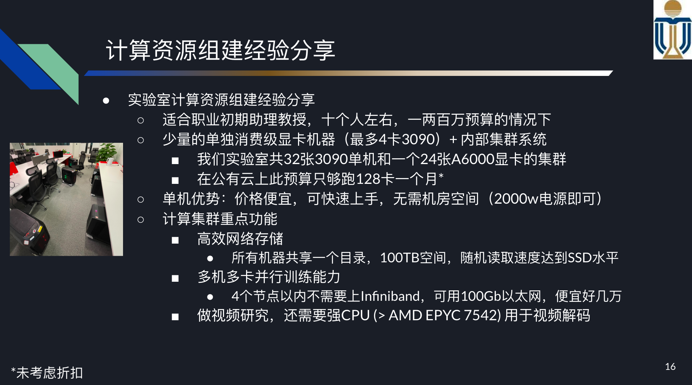

## GPU Comparisons

### Contents
1. My lab's computing setup; [link](#computing-setup-of-my-lab)
2. Cloud GPU and whole machine price comparison and notes (云GPU与整机价格对比); [link](#price-comparison)
3. Free compute available from companies（教授可申请的免费计算资源）; [link](#free-stuff)
4. Useful learning material on GPUs and setting up your clusters（如何搭建计算集群）; [link](#learning-stuff)

## Computing Setup of My Lab

In my lab, the [Precognition Lab](http://precognition.team/), using the start-up funds provided by the university, I have built 9 stand-alone machines equipped with a total of 32 RTX 3090/4090 GPUs (including 4-GPU and some 2-GPU machines). Additionally, I have established a cluster with 3 compute nodes, comprising a total of 24 RTX A6000 GPUs, and a 100TB NAS.

The rationale behind this hybrid setup is twofold: the stand-alone machines cost only 40% of what the cluster does, and they can be acquired quickly without necessitating additional machine room space.

As for the cluster, I've found that a 100 GB Ethernet suffices for the computing network, eliminating the need to invest in an Infiniband switch, which can cost two to three times more. With 3 nodes on this network, I can essentially achieve linear scaling with multi-node training (6 hours for 1-node training and 2 hours for 3-node training, etc.).

</img>

## Price Comparison

Vendors in mainland, China (Updated 07/2022):

|          | Machine          | Duration           | Price (RMB)         | Note                        |
|----------|---------------|----------------|----------------|------------------------------------------------|
| 阿里     | 8xV100 (16GB) | 一年           | 80万           | 只有CentOS                                     |
|          |               | 一个月         | 7.1万          |                                                |
|          |               | 一小时         |         248.42 |                                                |
| 华为云   | 8xV100 (32GB) | 一年           | 63万           |                                                |
|          |               | 一个月         | 6.3万          |                                                |
|          |               | 一小时         |          131.5 |                                                |
| 腾讯云   | 8xV100 (32GB) | 一年           | 45.8万(8.3折)  |  [link](https://cloud.tencent.com/document/product/560/8025) |
|          |               | 一个月         | 4.6万          |                                                |
|          |               | 一小时 (TIONE) |            147 |                                                |
|          | 8xA100 (40GB) | 一年           | 113.5万(8.3折) |                                                |
|          |               | 一个月         | 11.4万         |                                                |
| 百度云   | 8xA100 (40GB) | 一年           | 99.7万(8.3折)  | [link](https://cloud.baidu.com/product-price/gpu.html) |
|          |               | 一个月         | 10万           |                                                |
|          | 8xV100 (32GB) | 一年           | 59.3万         |                                                |
|          |               | 一个月         | 5.9万          |                                                |
|          |               | 一小时         |         124.14 |                                                |
| 矩池云   | 8xV100 (16GB) | 一小时         |             48 |                                                |
| 智星云   | 8x3090 (24GB) | 一个月         | 2.1万          |                                                |
|          |               | 一小时         |             36 |                                                |
|          | 8xA100 (40GB) | 一个月         | 4.5万          |                                                |
|          |               | 一小时         |             76 |                                                |
|          | 8xV100 (32GB) | 一个月         | 2.8万          |                                                |
|          |               | 一小时         |             48 |                                                |
| 极链AI云 |               |                |                |                                                |
| 恒源云   |               |                |                |                                                |
| AutoDL   |               |                |                |                          [link](https://www.autodl.com/) , Most Popular                      |
| OpenBayes |               |               |                 |                 [link](https://openbayes.com/)         |

整机购买 (08/2022咨询)

|               | 机器   |            |
|---------------|--------|------------|
| dbcloud深脑云 (淘宝) | 8x3090 | 20万左右起 |
|程明明教授的经验|8xV100| [link](https://mmcheng.net/dlm/)|

**Junwei: 近期(09/2022)GPU价格大跌，明显是整机购买比较划算，而3090的算力相当于V100，是性价比最高的卡，所以我认为多个8x3090整机+网络硬盘NAS+kubeflow是最划算、scalable的设置，可以参考一下[后面](#learning-stuff)如何自建计算集群。**

Vendors in NA (Updated 07/2022):

|                          | Machine             | Duration            | Price        |
|--------------------------|------------------|-----------------|-------------|
| Google Cloud asia-Taiwan | 8xV100 (32GB)    | 1 month          | $12,837.30  |
|                          |                  | 1 hour          |        $17  |
| Google Cloud asia-Tokyo  | 8xA100 (40GB)    | 1 month          | $18,216.98  |
| vast.ai NA               | 8xV100 (16GB)    | 1 hour          |      $2.80  |
|                          | 8xA100 (40GB)    | 1 hour         |      $8.80  |
|                          | 8xA6000 (48GB)   | 1 hour         |      $4.40  |
|                          | 10x1080Ti (11GB) | 1 hour         |         $2  |
|                          | 8xA5000 (24GB)   | 1 hour          |      $2.40  |
|                          | 4x3090 (24GB)    | 1 hour          |      $1.20  |
| lambda NA                | 8xV100 (16GB)    | 1 hour         |      $4.40  |
|                          | 8xV100 (16GB)    | 1 hour (>3 months) |      $3.20  |
|                          | 8xA100 (40GB)    | 1 hour (>3 months) |      $8.00  |
|                          | 1xA100 (40GB)    | 1 hour |      $1.10 [link](https://www.youtube.com/watch?v=tWVq4GxSCps)  |

## Free Stuff

|              | note                                                                   | link                                                                                                                                                                                                                                                                                                                                                              |
|--------------|------------------------------------------------------------------------|-------------------------------------------------------------------------------------------------------------------------------------------------------------------------------------------------------------------------------------------------------------------------------------------------------------------------------------------------------------------|
| 幻方AI       | 万卡算力，免费申请，酣畅科研的夏天                                     | [link](https://mp.weixin.qq.com/s?__biz=Mzk0MjE3MzQ5Mg==&mid=2247484702&idx=1&sn=5157e2c6564c41171ad7973f861e3a12&chksm=c2c67945f5b1f053a997f8213dee6284e9c1ecedaf13fd4f6165a6aaea77eee92ed3320da163&mpshare=1&scene=1&srcid=0715juU6U4wioPfFdA6loJQX&sharer_sharetime=1660101801014&sharer_shareid=c5b6fadc801a2c4ecd6ca0096153aea4&version=4.0.9.99149&platform=mac#rd) |
| NVIDIA       | 有一张免费卡的资助项目                                                 |                                                                                                                                                                                                                                                                                                                                                                   |
| AWS          | 在CMU上课的时候，每门课教授都可以给每个学生申请100刀左右的cloud credit |                                                                                                                                                                                                                                                                                                                                                                   |
| Google Cloud | 类似AWS                                                                |                                                                                                                                                                                                                                                                                                                                                                   |

## Learning Stuff

| note                     | link                                                |
|--------------------------|-----------------------------------------------------|
| GPU guide from Lambda    | [link](https://lambdalabs.com/blog/best-gpu-2022-sofar/)    |
| understanding GPU and DL | [link](https://horace.io/brrr_intro.html)                   |
| 腾讯TEG星辰和机智团队    | [link](https://cloud.tencent.com/developer/article/1500001) |
| MPIJob                   | [link](https://github.com/kubeflow/mpi-operator)            |
| 机器学习平台             | [link](https://aijishu.com/a/1060000000136087)              |
| 集群硬盘，ceph cluster   | [link](https://www.45drives.com/products/cluster/)          |
| A discussion on machine price on Twitter (for NA)   | [link](https://twitter.com/WenhuChen/status/1565083349911326720)       |
| A discussion on 1xA100 vs 6x3090 知乎   | [link](https://www.zhihu.com/question/551536415/answer/2657911978)       |
|程明明教授的GPU集群经验|[link](https://mmcheng.net/servers/)|
|Good cluster building guide from Lambda| [link](https://www.youtube.com/watch?v=rfu5FwncZ6s)|
|How to decide on cloud GPUs vs. on-perm vs. hybrid| [link](https://www.youtube.com/watch?v=3EnIW0EZkr4)|

