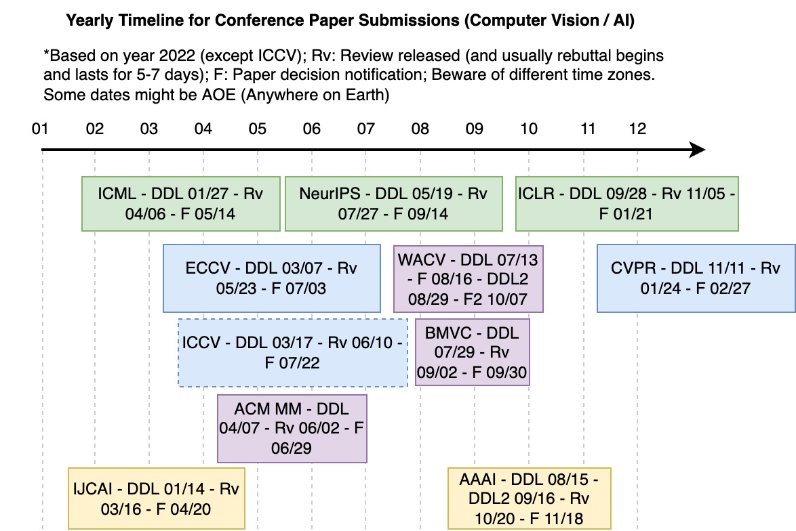

## Yearly Timeline for Conferences

### Contents
1. Paper submission; [Link](#paper-submission-schedule)
2. Workshop/Tutorial proposal; [Link](#workshop-and-tutorial-proposal-schedule)
3. Top Conference and Top Journal exchanges; [Link](#Top-Conference-and-Top-Journal-exchanges)
4. Year-round EI Conference; [Link](#Year-round-EI-Conference)

## Paper Submission Schedule

Currently this is for computer vision and AI in general.

</img>

## Workshop and Tutorial Proposal Schedule

To be added.

## Top Conference and Top Journal exchanges

Some useful conferences and journal exchanges (With journal and conference information)：微信小程序搜索【轻松参会】

## Year-round EI Conference

Link：[https://www.ais.cn/attendees](https://www.ais.cn/attendees)
