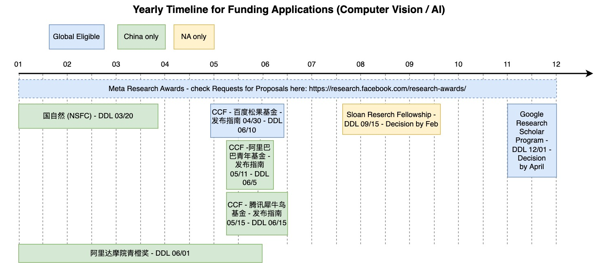

## Funding / Grant for TTAPs and Fellowships for PhD Students

### Contents
1. Research Grant; [Link](#research-grant)
2. PhD Fellowships; [Link](#phd-fellowships)

## Research Grant
| 名称                                                        | 链接                                                                                                                                                                                                                                                                                                                                                              | 可申请地区范围 | Note                                                       |
|-------------------------------------------------------------|-------------------------------------------------------------------------------------------------------------------------------------------------------------------------------------------------------------------------------------------------------------------------------------------------------------------------------------------------------------------|----------------|------------------------------------------------------------|
| 国自然青年基金                                                    |                                                                                                                                                                                                                                                                                                                                                                   | 国内           |                    每年3月份提交                 |
| 国自然面上基金                                                    |                                                                                                                                                                                                                                                                                                                                                                   | 国内           |                                                           |
| Google Research Scholar Program                             | [link](https://research.google/outreach/research-scholar-program/)                                                                                                                                                                                                                                                                                                        | The world      |        DDL 12.1, Decision by April (within PhD + 7 years, max submission 3 times) / $60k gift                 |
| 幻方AI 闲置算力资源申请                                                     | [link](https://www.high-flyer.cn/research/)                                                                                                                                                                                                                                                                                                                               | 国内        |                                                            |
| NSF CAREER                                                  | [link](https://beta.nsf.gov/funding/opportunities/faculty-early-career-development-program-career)                                                                                                                                                                                                                                                                        | US org only  |                                                            |
| NVIDIA应用                                                  | [link](https://www.nvidia.com/en-us/industries/higher-education-research/applied-research-program/)                                                                                                                                                                                                                                                                       | The world?     |                                                            |
| NVIDIA硬件资助项目                                          | [link](https://mynvidia.force.com/HardwareGrant/s/Application)                                                                                                                                                                                                                                                                                                            | The world?     |                                                            |
| Qualcomm                                                    | [link](https://www.qualcomm.com/research/university-relations)                                                                                                                                                                                                                                                                                                            | Some eligible universities    |                                                            |
| Microsoft                                                   | [link](https://www.microsoft.com/en-us/research/academic-program/microsoft-productivity-research/)                                                                                                                                                                                                                                                                        | US      |                                                            |
| 中国科协青年人才托举工程                                    |           [link](https://www.cast.org.cn/art/2022/6/28/art_457_190436.html) |  国内           |           2022年的申请要求32岁以下                                                 |
|广州科协人才托举|[link](https://mp.weixin.qq.com/s/Aol7WcYDfuoq1I8c2Am-Ag)|广州市高校推荐|35岁以下, 10万经费|
|CCF青年人才托举工程|[link](https://mp.weixin.qq.com/s/eHsDN7kmIQ9TCH1ISC5zOg)|国内|32岁以下，需要推荐人|
| 微软亚洲研究院铸星计划                                      | [link](https://www.msra.cn/zh-cn/connections/academic-programs/startrack)                                                                                                                                                                                                                                                                                                | 国内           |         5月申请，8月截止; 博士毕业5年内/需全职3-6个月访问北京微软亚研究院/需要院系单位推荐                                                   |
| CCF-百度松果基金                                            |     [link](https://www.ccf.org.cn/Focus/2022-04-29/761542.shtml) | 全球           |                要求40岁以下                                   |
| CCF-阿里巴巴创新研究计划                                    |    [link](https://www.ccf.org.cn/Focus/2022-05-11/761872.shtml)     | 国内           |              2022年有设定好的13个方向的项目基金  |
| 国家重点研发计划资助项目: National Key R&D Program of China |       [link](https://chinainnovationfunding.eu/zh/national-key-rd-programmes/) | 国内           |                                                            |
| Meta研究funding                                             | [link](https://research.facebook.com/research-awards/)                                                                                                                                                                                                                                                                                                                    | The world     | various call for proposals/~$100k gift                                        |
| 腾讯高校合作项目                                            |               [link](https://ur.tencent.com/)                                                                                                                                                                                                                                                                                                                                                    | 国内           |  |
| 达摩院青橙奖                                                | [link](https://damo.alibaba.com/damo-academy-young-fellow?lang=zh)                                                                                                                                                                                                                                                                                                        | 国内           | 100万人民币, 35岁以下，                                                |
| CCF-犀牛鸟基金（腾讯）                                      | [link](https://ur.tencent.com/article/1429) | 国内           |                                      2022年要求1986年后出生, 博士毕业5年内                      |
| CCF-华为胡杨林基金                                          | [link](https://mp.weixin.qq.com/s?__biz=MjM5MTY5ODE4OQ==&mid=2651526923&idx=1&sn=43caeab6b55ba40ba736d2a72e0ca11c&chksm=bd4e2b698a39a27f349c6ac93754a8bcad97bdb245a5cfd7ae462091900ac1a67d6716afce0e&mpshare=1&scene=1&srcid=0801kPEJS2U8sWH1NL0nVt0Z&sharer_sharetime=1659346144614&sharer_shareid=c5b6fadc801a2c4ecd6ca0096153aea4&version=4.0.9.99149&platform=mac#rd) [软件工程](https://www.ccf.org.cn/Collaboration/Enterprise_Fund/News/hw/2022-04-29/761525.shtml) | 国内           |                                                        有多个大方向和子方向， 好像没有年龄限制    |
| CCF科技成果奖                                               | [link](https://mp.weixin.qq.com/s?__biz=MjM5MTY5ODE4OQ==&mid=2651529471&idx=1&sn=06a1308372d72faf029e1dd4ff0c08d9&chksm=bd4e1c9d8a39958bff0122bf2c1607deac93234524bceacd7f13e0c5d83702279775e23d0126&mpshare=1&scene=1&srcid=0818Mz94BVedMMRCBVOpfBtj&sharer_sharetime=1660813802956&sharer_shareid=c5b6fadc801a2c4ecd6ca0096153aea4&version=4.0.9.99149&platform=mac#rd) | 国内           |                                                     杰青level的吧       |
| Google GCP eduation                                         | [link](https://edu.google.com/programs/express-interest/?modal_active=none)                                                                                                                                                                                                                                                                                               | 教学credits    |                                                            |
| AWS class credits                                           |          [link](https://aws.amazon.com/cn/blogs/aws/aws-educate-credits-training-content-and-collaboration-for-students-educators/)                                                                                                                                | 教学credits    |                                                            |
| CCF优秀博士发展计划                                         | [link](https://mp.weixin.qq.com/s?__biz=MjM5MTY5ODE4OQ==&mid=2651530270&idx=1&sn=571ada3d01272fd2a3f237180b14dcdd&chksm=bd4e187c8a39916a4ad099ae90edbb08f3d1af539df8f5f60c2e7060ce474edd96aa05eb7d80&mpshare=1&scene=1&srcid=0830greLZB2rSRlGaKMP1w7u&sharer_sharetime=1661850938788&sharer_shareid=c5b6fadc801a2c4ecd6ca0096153aea4&version=4.0.9.99149&platform=mac#rd) | 国内           |                                                            |
| TR35, MIT 35 under 35 Asia                                        |                 [link](http://tr35.mittrasia.com/#criteria) | 亚洲地区    |     这个title很厉害，没有奖金                         |
| AAAI New Faculty Highlight                                       |                 [link](https://aaai.org/Conferences/AAAI-21/aaai-new-faculty-highlights-program/) | The world	    |     只是个 title               |
| Sloan Research Fellowship                                       |                 [link](https://sloan.org/fellowships) | US + Canada	    |     $75k, for tenure-track AP, need department head's nomination |
| Sony Faculty Research Award|[link](https://www.sony.com/en/SonyInfo/research-award-program)| US + 19 countries, no China|$100k/$150k, yearly application DDL: Sep 15|
| Amazon Research Award (ARA) |[link](https://www.amazon.science/research-awards/call-for-proposals)|The world| Each season may have a CFP. Budget supports one or two grad students for a year.|
|腾讯AI Lab犀牛鸟专项研究计划|[link](https://m.withzz.com/project?id=1313)|国内/海外|20-40万元/4-6万美元|
|国家特支计划/万人计划|[link](https://baike.baidu.com/item/%E5%9B%BD%E5%AE%B6%E9%AB%98%E5%B1%82%E6%AC%A1%E4%BA%BA%E6%89%8D%E7%89%B9%E6%AE%8A%E6%94%AF%E6%8C%81%E8%AE%A1%E5%88%92/3584383)|国内|每年2月份通过学校提交|

Timeline:

</img>

## PhD Fellowships

| name                                                | note | link |
|-----------------------------------------------------|------|------|
| Google PhD Fellowship                               |   多个方向不定人数，全世界可申请   |   [link](https://research.google/outreach/phd-fellowship/)   |
| Meta                                                |   全世界可申请   |   [link](https://research.facebook.com/fellowship/)   |
| Nvidia                                              |  全世界可申请；二年级博士生以上 (international students are eligible; must be at least after first-year)    |   [link](https://www.nvidia.com/en-us/research/graduate-fellowships/)   |
| Microsoft                                           |   全世界可申请   |   [link](https://www.microsoft.com/en-us/research/academic-program/phd-fellowship/)   |
| 百度奖学金                                          |      |    [link](http://scholarship.baidu.com/)  |
| Qualcomm PhD Fellowship                             |    No China!  |   [link](https://www.qualcomm.com/research/university-relations/innovation-fellowship)   |
| Microsoft Research Asia Fellowship                  |    微软学者奖学金  |    [link](https://www.msra.cn/zh-cn/connections/academic-programs/fellows)  |
| "Star of Tomorrow" Award at Microsoft Research Asia |      |    |
| 郑格如基金                                          |      |      |
| 字节跳动奖学金                                          |   中国大陆高校   |   [link](https://ur.bytedance.com/scholarship)   |
| MIT EECS Rising Stars                                          |      |      |
| A list by Deborah                                          |      |   [link](https://github.com/dhanus/graduate-fellowships)   |
| Siebel Scholars                                          |  $35k for final year students, from US, China, Japan, etc.    |   [link](https://www.siebelscholars.com/)   |
| AAAI/ACM SIGAI DOCTORAL DISSERTATION AWARD | Just a title (but a prestigious one) | [link](https://aaai.org/Awards/dissertation-award.php)|
| 商汤奖学金 | **本科生**30名，2万RMB|[介绍](https://mp.weixin.qq.com/s?__biz=MzU2Nzg2NDc4Ng==&mid=2247535807&idx=1&sn=758bc45ea586a58def682ac3548ad0f0&chksm=fc94b002cbe3391455fd241fc0d3f068e7509114e02263f886b797774d396367fb35fedcfec5&scene=21#wechat_redirect) [主页](https://www.sensetime.com/cn/scholarship)|
| Apple PhD  Fellowship||[link](https://machinelearning.apple.com/updates/introducing-apple-scholars-aiml)|
